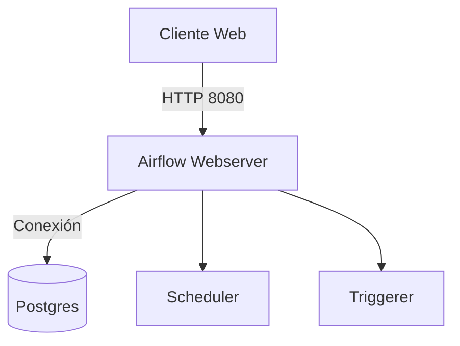

# 🪄 Airflow + Postgres Stack

Este proyecto levanta un entorno completo de **Apache Airflow 3.1.0**, **Python 3.11** y **PostgreSQL 16** como backend, usando `docker compose`.  
Está diseñado para acercarse lo máximo posible a producción.

> 🧪 **Versión del stack:**  
> • Apache Airflow `3.1.0`  
> • Python `3.11`  
> • PostgreSQL `16`  
> • Docker Compose compatible `≥ 2.20`

---

## 📜 Índice
- [⚡ Requisitos](#-requisitos)
- [🚀 Instalación y arranque](#-instalación-y-arranque)
- [🧱 Arquitectura](#-arquitectura)
- [🌿 Variables de entorno](#-variables-de-entorno)
- [🧰 Comandos útiles](#-comandos-útiles)
- [🐘 Postgres](#-postgres)
- [📊 Airflow](#-airflow)
- [🛠 Troubleshooting](#-troubleshooting)
- [📝 Changelog](#-changelog)

---

## ⚡ Requisitos

- Docker Engine ≥ 24  
- Docker Compose ≥ 2.20  

---

## 🚀 Instalación y arranque

```bash
# Clonar el repositorio
git clone https://github.com/tu_usuario/airflow.git
cd airflow

# Inicializar Airflow y la base de datos
docker compose up airflow-init

# Levantar todo el stack
docker compose up -d
```

📍 **Interfaz Web:** [http://localhost:8080](http://localhost:8080)  
👤 Usuario por defecto: `admin`  
🔐 Contraseña por defecto: `admin`

---

## 🧱 Arquitectura



---

## 🌿 Variables de entorno (cambiar en producción)

⚠️ **Importante:** Cambia las credenciales y la clave Fernet antes de desplegar en producción.

```env
POSTGRES_USER=airflow
POSTGRES_PASSWORD=airflow
POSTGRES_DB=airflow
AIRFLOW_ADMIN_USER=admin
AIRFLOW_ADMIN_PASSWORD=admin
AIRFLOW_ADMIN_EMAIL=admin@example.com
AIRFLOW_FERNET_KEY=
```

Cómo generar la clave Fernet:

```bash
# Crea el entorno virtual
python -m venv .venv

# Actívalo
.\.venv\Scripts\Activate

# Instala la dependencia mínima
pip install cryptography

# Generar la clave Fernet
python -c "from cryptography.fernet import Fernet; print(Fernet.generate_key().decode())"
```

---

## 🧰 Comandos útiles

```bash
# Clonar el repositorio
git clone https://github.com/isarubio95/Airflow-Panoimagen.git
cd Airflow-Panoimagen

# Levantar todo el stack
docker compose up -d
```


---
